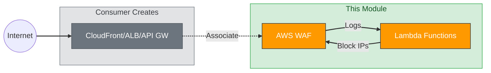
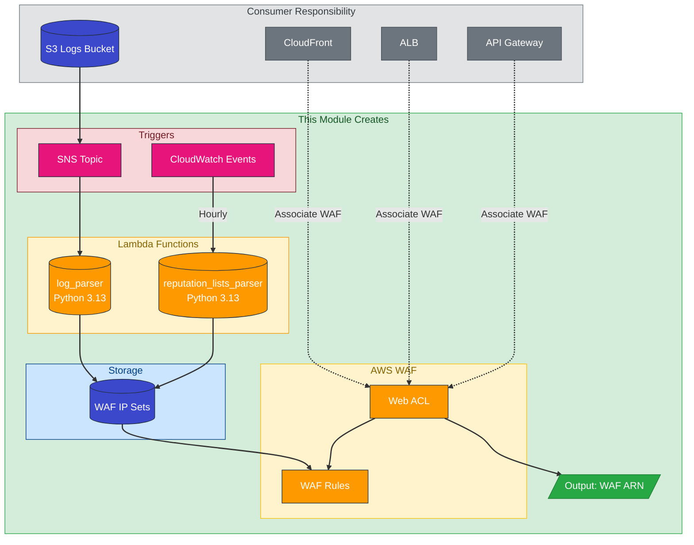
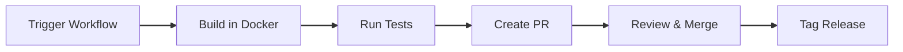

# AWS WAF Terraform Module

A Terraform module for deploying AWS WAF (Web Application Firewall) with automated Lambda-based threat detection and IP reputation management.

[](LICENSE)

## Table of Contents

- [Overview](#overview)
- [Quick Start: Update Lambda](#quick-start-update-lambda)
- [Features](#features)
- [How It Works](#how-it-works)
  - [Log Parser Lambda](#log-parser-lambda)
  - [Reputation Lists Parser Lambda](#reputation-lists-parser-lambda)
- [Prerequisites](#prerequisites)
- [Usage](#usage)
- [Architecture](#architecture)
- [WAF Rules](#waf-rules)
- [Inputs](#inputs)
- [Outputs](#outputs)
- [Lambda Build Process](#lambda-build-process)
  - [Upstream Version Selection](#upstream-version-selection)
  - [Triggering Lambda Updates](#triggering-lambda-updates-github-actions)
  - [Version Bump Guidelines](#version-bump-guidelines)
  - [Local Build](#local-build)
- [Versioning](#versioning)
- [Documentation](#documentation)
- [File Structure](#file-structure)
- [Contributing](#contributing)
- [License](#license)
- [References](#references)

---

## Overview

This module deploys a complete WAF solution including:
- **Web ACL** with OWASP Top 10 protection rules
- **Log Parser Lambda** - Analyzes WAF logs and blocks malicious IPs
- **Reputation Lists Parser Lambda** - Syncs external IP threat intelligence



> **Note:** This module creates the WAF and outputs its ARN. You must create your own CloudFront/ALB/API Gateway and associate them using `aws_wafv2_web_acl_association`.

## Quick Start: Update Lambda

To update WAF Lambda packages to a new upstream version:

```bash
gh workflow run "Build WAF Lambda Packages" \
  -f upstream_ref=v4.1.2 \
  -f version_bump=patch
```

See [docs/QUICKSTART.md](docs/QUICKSTART.md) for the full step-by-step guide.

## Features

| Feature | Description |
|---------|-------------|
| **OWASP Protection** | SQL injection, XSS, path traversal, and more |
| **Automated Blocking** | Lambda functions automatically block malicious IPs |
| **Reputation Lists** | Integration with external IP blocklists |
| **Multi-Scope** | Works with CloudFront (edge) and regional resources |

## How It Works

### Log Parser Lambda

The `log_parser` Lambda function provides **reactive threat detection**:

1. **Trigger**: WAF logs are written to S3, which sends a notification to SNS
2. **Analysis**: Lambda parses the logs looking for:
   - **HTTP Flood attacks** - IPs making excessive requests (DDoS patterns)
   - **Scanners/Probes** - IPs triggering 4xx errors (vulnerability scanning)
3. **Action**: Malicious IPs are added to WAF IP Sets, blocking future requests

```
S3 (WAF Logs) → SNS → log_parser Lambda → Updates IP Sets → WAF blocks IP
```

### Reputation Lists Parser Lambda

The `reputation_lists_parser` Lambda provides **proactive threat prevention**:

1. **Trigger**: CloudWatch Events runs the Lambda hourly
2. **Fetch**: Downloads known-bad IP lists from threat intelligence sources:
   - [Spamhaus DROP](https://www.spamhaus.org/drop/) - Known spammer networks
   - [Spamhaus EDROP](https://www.spamhaus.org/drop/) - Extended drop list
   - [Tor Exit Nodes](https://check.torproject.org/) - Anonymous proxy exits
   - [Emerging Threats](https://rules.emergingthreats.net/) - Community blocklist
3. **Action**: Updates WAF IP Sets to block these IPs before they attack

```
CloudWatch (hourly) → reputation_lists_parser Lambda → Fetches lists → Updates IP Sets
```

### IP Sets Updated

| IP Set | Updated By | Purpose |
|--------|------------|---------|
| `HTTPFloodSetIPV4/V6` | log_parser | Blocks flood attackers |
| `ScannersProbesSetIPV4/V6` | log_parser | Blocks vulnerability scanners |
| `IPReputationListsSetIPV4/V6` | reputation_lists_parser | Blocks known-bad IPs |

## Prerequisites

Before using this module, you must create:

### 1. S3 Logging Bucket

```hcl
resource "aws_s3_bucket" "waf_logs" {
  bucket = "my-app-waf-logs"
}
```

### 2. Dead Letter Queue (Required for Lambda Error Handling)

```hcl
# SQS Queue for failed Lambda invocations
resource "aws_sqs_queue" "waf_dlq" {
  name = "my-app-waf-dlq"

  # Optional: encrypt with KMS
  # kms_master_key_id = aws_kms_key.main.id
}

# IAM Policy allowing Lambda to send to DLQ
resource "aws_iam_policy" "waf_dlq" {
  name = "my-app-waf-dlq-policy"

  policy = jsonencode({
    Version = "2012-10-17"
    Statement = [{
      Effect   = "Allow"
      Action   = ["sqs:SendMessage"]
      Resource = [aws_sqs_queue.waf_dlq.arn]
    }]
  })
}
```

### 3. KMS Key (Optional but Recommended)

```hcl
resource "aws_kms_key" "waf" {
  description = "KMS key for WAF encryption"
}
```

## Usage

```hcl
module "waf" {
  source = "git@github.com:datastreamapp/terraform-waf-module?ref=v3.0.0"

  scope          = "REGIONAL"  # or "CLOUDFRONT"
  name           = "my-app"
  logging_bucket = aws_s3_bucket.waf_logs.id

  dead_letter_arn        = aws_sqs_queue.waf_dlq.arn
  dead_letter_policy_arn = aws_iam_policy.waf_dlq.arn

  # Optional KMS encryption
  # kms_master_key_id  = aws_kms_key.waf.id
  # kms_master_key_arn = aws_kms_key.waf.arn
}
```

## Architecture

See [docs/ARCHITECTURE.md](docs/ARCHITECTURE.md) for detailed architecture diagrams.

### System Overview



> See [docs/ARCHITECTURE.md](docs/ARCHITECTURE.md) for code references proving each element.

### Lambda Functions

| Lambda | Trigger | Purpose |
|--------|---------|---------|
| `log_parser` | SNS (from S3 logs) | Parses WAF logs, blocks suspicious IPs |
| `reputation_lists_parser` | CloudWatch (hourly) | Syncs external IP reputation lists |

**Runtime:** Python 3.13 on Amazon Linux 2023

### Why Python 3.13 (not 3.14)?

| Factor | Python 3.13 | Python 3.14 |
|--------|-------------|-------------|
| Upstream Compatibility | Closer to upstream's 3.12 | Untested |
| Stability | Mature release | Bleeding edge |
| Dependency Risk | Lower | Higher |

The upstream [aws-waf-security-automations](https://github.com/aws-solutions/aws-waf-security-automations)
repository specifies `python = ~3.12` in their pyproject.toml. Using Python 3.13 provides a balance between
newer features and maintaining compatibility with upstream-tested dependencies.

See [docs/CHANGELOG.md](docs/CHANGELOG.md) for detailed rationale.

## WAF Rules

```
Web ACL
|- Blacklist Group
|  |- Bad Bot Rule
|  |- Blacklist Rule
|  |- HTTP Flood Rule
|  |- Reputation List Rule
|  |- Scanner Probes Rule
|- OWASP Group
|  |- Admin URL Rule
|  |- Auth Token Rule
|  |- CSRF Rule
|  |- Paths Rule
|  |- Server Side Include Rule
|  |- Size Restriction Rule
|  |- SQL Injection Rule
|  |- XSS Rule
|- Whitelist Rule
```

## Inputs

| Name | Description | Type | Default |
|------|-------------|------|---------|
| `scope` | WAF scope (`REGIONAL` or `CLOUDFRONT`) | `string` | `"CLOUDFRONT"` |
| `name` | Application name | `string` | required |
| `defaultAction` | Default action (`ALLOW` or `DENY`) | `string` | `"DENY"` |
| `logging_bucket` | S3 bucket for logs | `string` | required |

See [variables.tf](variables.tf) for full list of inputs.

## Outputs

| Name | Description |
|------|-------------|
| `id` | WAF Web ACL ID |
| `arn` | WAF Web ACL ARN |

## Lambda Build Process

Lambda packages are built automatically from [aws-solutions/aws-waf-security-automations](https://github.com/aws-solutions/aws-waf-security-automations).

### Upstream Version Selection

Before triggering a build, check the upstream changelog for available versions:
- **Upstream Changelog:** https://github.com/aws-solutions/aws-waf-security-automations/blob/main/CHANGELOG.md

| Field | Description |
|-------|-------------|
| **Current Default** | `v4.0.3` (configured in workflow) |
| **Where to Check** | [Upstream CHANGELOG.md](https://github.com/aws-solutions/aws-waf-security-automations/blob/main/CHANGELOG.md) |

### Triggering Lambda Updates (GitHub Actions)



**To update Lambda packages with a new upstream version:**

1. Go to **Actions** tab in GitHub
2. Select **Build WAF Lambda Packages** workflow
3. Click **Run workflow** button
4. Configure the workflow inputs:

| Input | Description | Example |
|-------|-------------|---------|
| **upstream_ref** | Tag from upstream repo to build from | `v4.0.3`, `v4.1.0`, `v4.1.2` |
| **version_bump** | How to bump this module's version | `none`, `patch`, `minor`, `major` |

5. Click **Run workflow** to start the build
6. Review and merge the generated PR
7. Create release tag after merge (if version bump was requested)

### Version Bump Guidelines

| Bump Type | When to Use | Example |
|-----------|-------------|---------|
| `none` | Testing build, no release planned | Local validation |
| `patch` | Security updates, bug fixes from upstream | `v4.0.3` → `v4.0.4` security patch |
| `minor` | New features, dependency updates | `v4.0.x` → `v4.1.0` feature release |
| `major` | Breaking changes, Python runtime upgrade | Python 3.12 → 3.13 |

### Workflow Inputs Reference

The workflow is defined in `.github/workflows/build-lambda-packages.yml`:

```yaml
inputs:
  upstream_ref:
    description: 'Upstream repo tag (e.g., v4.0.3)'
    default: 'v4.0.3'  # Update this to change default version
  version_bump:
    description: 'Version bump type for this release'
    options: ['none', 'patch', 'minor', 'major']
```

**To change the default upstream version**, edit the `default` value in the workflow file.

### Local Build

```bash
# Clone upstream source
git clone --depth 1 --branch v4.0.3 \
  https://github.com/aws-solutions/aws-waf-security-automations.git upstream

# Build Docker image
docker build -t lambda-builder -f scripts/Dockerfile.lambda-builder scripts/

# Build packages
docker run --rm \
  -v $(pwd)/upstream:/upstream:ro \
  -v $(pwd)/lambda:/output \
  lambda-builder log_parser /upstream /output

docker run --rm \
  -v $(pwd)/upstream:/upstream:ro \
  -v $(pwd)/lambda:/output \
  lambda-builder reputation_lists_parser /upstream /output
```

### Build Validation

The build process includes comprehensive tests:

**Positive Tests:**
- Zip file exists and not empty
- Handler file present
- Size under 50MB Lambda limit
- Required shared libraries included
- Security scan (pip-audit)

**Negative Tests:**
- No `__pycache__` directories
- No `.pyc` bytecode files
- Zip integrity verified
- Import validation passes

## Versioning

This project follows [Semantic Versioning](https://semver.org/).

| Version Type | When to Use |
|--------------|-------------|
| **major** | Breaking changes (Python upgrade, API changes) |
| **minor** | New features, dependency updates |
| **patch** | Bug fixes, security patches |

Current version: See [docs/CHANGELOG.md](docs/CHANGELOG.md)

## Documentation

| Document | Description |
|----------|-------------|
| [README.md](README.md) | This file |
| [docs/QUICKSTART.md](docs/QUICKSTART.md) | How to update WAF Lambda packages |
| [docs/CHANGELOG.md](docs/CHANGELOG.md) | Version history and decisions |
| [docs/TODOLIST-801.md](docs/TODOLIST-801.md) | Implementation task tracking |
| [docs/RETROSPECTIVE.md](docs/RETROSPECTIVE.md) | Lessons learned, checklists, and governance |
| [docs/ARCHITECTURE.md](docs/ARCHITECTURE.md) | Architecture diagrams |
| [docs/TESTING.md](docs/TESTING.md) | Testing guide |

## File Structure

```
terraform-waf-module/
|- .github/
|  |- workflows/
|     |- build-lambda-packages.yml  # Lambda build workflow
|     |- test.yml                   # CI/CD test workflow
|- docs/
|  |- ARCHITECTURE.md               # Architecture diagrams
|  |- CHANGELOG.md                  # Version history
|  |- QUICKSTART.md                 # How to update Lambda packages
|  |- RETROSPECTIVE.md              # Lessons learned
|  |- TESTING.md                    # Testing guide
|  |- TODOLIST-801.md               # Implementation task tracking
|- lambda/
|  |- log_parser.zip                # Built artifact
|  |- reputation_lists_parser.zip   # Built artifact
|  |- LICENSE.txt
|- scripts/
|  |- Dockerfile.lambda-builder     # Build environment
|  |- build-lambda.sh               # Build script
|- lambda.log-parser.tf             # Lambda TF config
|- lambda.reputation-list.tf        # Lambda TF config
|- main.tf                          # WAF Web ACL
|- Makefile                         # Build and test automation
|- README.md                        # Project documentation
```

## Contributing

1. Create feature branch from `master`
2. Make changes
3. Create PR for review
4. Merge after approval

## License

Apache 2.0 - See [LICENSE](LICENSE)

## References

- [AWS WAF Security Automations](https://github.com/aws-solutions/aws-waf-security-automations)
- [AWS WAF Documentation](https://docs.aws.amazon.com/waf/)
- [OWASP Top 10](https://owasp.org/www-project-top-ten/)
