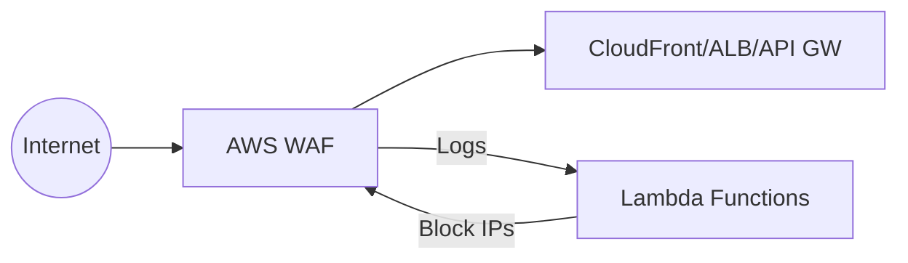
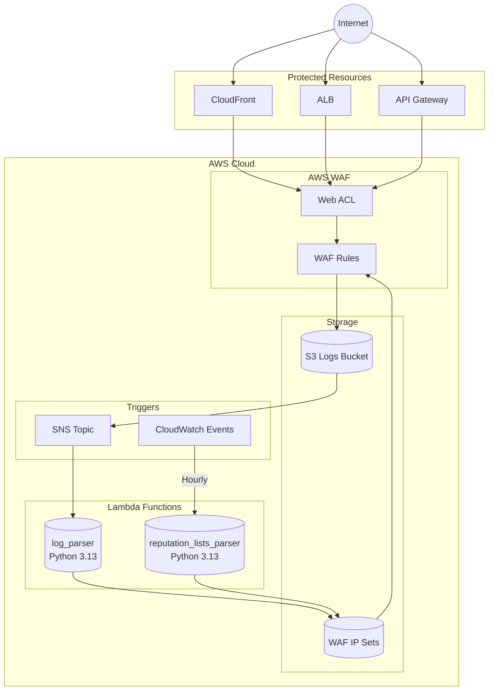
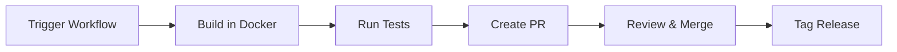

# AWS WAF Terraform Module

A Terraform module for deploying AWS WAF (Web Application Firewall) with automated Lambda-based threat detection and IP reputation management.

[](LICENSE)

## Overview

This module deploys a complete WAF solution including:
- **Web ACL** with OWASP Top 10 protection rules
- **Log Parser Lambda** - Analyzes WAF logs and blocks malicious IPs
- **Reputation Lists Parser Lambda** - Syncs external IP threat intelligence



## Features

| Feature | Description |
|---------|-------------|
| **OWASP Protection** | SQL injection, XSS, path traversal, and more |
| **Automated Blocking** | Lambda functions automatically block malicious IPs |
| **Reputation Lists** | Integration with external IP blocklists |
| **Multi-Scope** | Works with CloudFront (edge) and regional resources |

## Quick Start

```hcl
module "waf" {
  source = "git@github.com:datastreamapp/terraform-waf-module?ref=v3.0.0"

  scope         = "REGIONAL"  # or "CLOUDFRONT"
  name          = "my-app"
  defaultAction = "ALLOW"

  logging_bucket = "my-app-waf-logs"
}
```

## Architecture

See [docs/ARCHITECTURE.md](docs/ARCHITECTURE.md) for detailed architecture diagrams.

### System Overview



### Lambda Functions

| Lambda | Trigger | Purpose |
|--------|---------|---------|
| `log_parser` | SNS (from S3 logs) | Parses WAF logs, blocks suspicious IPs |
| `reputation_lists_parser` | CloudWatch (hourly) | Syncs external IP reputation lists |

**Runtime:** Python 3.13 on Amazon Linux 2023

### Why Python 3.13 (not 3.14)?

| Factor | Python 3.13 | Python 3.14 |
|--------|-------------|-------------|
| Upstream Compatibility | Closer to upstream's 3.12 | Untested |
| Stability | Mature release | Bleeding edge |
| Dependency Risk | Lower | Higher |

The upstream [aws-waf-security-automations](https://github.com/aws-solutions/aws-waf-security-automations)
repository specifies `python = ~3.12` in their pyproject.toml. Using Python 3.13 provides a balance between
newer features and maintaining compatibility with upstream-tested dependencies.

See [CHANGELOG.md](CHANGELOG.md) for detailed rationale.

## WAF Rules

```
Web ACL
|- Blacklist Group
|  |- Bad Bot Rule
|  |- Blacklist Rule
|  |- HTTP Flood Rule
|  |- Reputation List Rule
|  |- Scanner Probes Rule
|- OWASP Group
|  |- Admin URL Rule
|  |- Auth Token Rule
|  |- CSRF Rule
|  |- Paths Rule
|  |- Server Side Include Rule
|  |- Size Restriction Rule
|  |- SQL Injection Rule
|  |- XSS Rule
|- Whitelist Rule
```

## Inputs

| Name | Description | Type | Default |
|------|-------------|------|---------|
| `scope` | WAF scope (`REGIONAL` or `CLOUDFRONT`) | `string` | `"CLOUDFRONT"` |
| `name` | Application name | `string` | required |
| `defaultAction` | Default action (`ALLOW` or `DENY`) | `string` | `"DENY"` |
| `logging_bucket` | S3 bucket for logs | `string` | required |

See [variables.tf](variables.tf) for full list of inputs.

## Outputs

| Name | Description |
|------|-------------|
| `id` | WAF Web ACL ID |
| `arn` | WAF Web ACL ARN |

## Lambda Build Process

Lambda packages are built automatically from [aws-solutions/aws-waf-security-automations](https://github.com/aws-solutions/aws-waf-security-automations).

### Automated Build (Recommended)



1. Go to **Actions** > **Build WAF Lambda Packages**
2. Click **Run workflow**
3. Configure:
   - **Upstream ref**: Tag (e.g., `v4.0.3`)
   - **Version bump**: `none`, `patch`, `minor`, `major`
4. Review and merge the generated PR
5. Create release tag after merge

### Local Build

```bash
# Clone upstream source
git clone --depth 1 --branch v4.0.3 \
  https://github.com/aws-solutions/aws-waf-security-automations.git upstream

# Build Docker image
docker build -t lambda-builder -f scripts/Dockerfile.lambda-builder scripts/

# Build packages
docker run --rm \
  -v $(pwd)/upstream:/upstream:ro \
  -v $(pwd)/lambda:/output \
  lambda-builder log_parser /upstream /output

docker run --rm \
  -v $(pwd)/upstream:/upstream:ro \
  -v $(pwd)/lambda:/output \
  lambda-builder reputation_lists_parser /upstream /output
```

### Build Validation

The build process includes comprehensive tests:

**Positive Tests:**
- Zip file exists and not empty
- Handler file present
- Size under 50MB Lambda limit
- Required shared libraries included
- Security scan (pip-audit)

**Negative Tests:**
- No `__pycache__` directories
- No `.pyc` bytecode files
- Zip integrity verified
- Import validation passes

## Versioning

This project follows [Semantic Versioning](https://semver.org/).

| Version Type | When to Use |
|--------------|-------------|
| **major** | Breaking changes (Python upgrade, API changes) |
| **minor** | New features, dependency updates |
| **patch** | Bug fixes, security patches |

Current version: See [CHANGELOG.md](CHANGELOG.md)

## Documentation

| Document | Description |
|----------|-------------|
| [README.md](README.md) | This file |
| [CHANGELOG.md](CHANGELOG.md) | Version history and decisions |
| [TODOLIST.md](TODOLIST.md) | Implementation tasks |
| [docs/ARCHITECTURE.md](docs/ARCHITECTURE.md) | Architecture diagrams |

## File Structure

```
terraform-waf-module/
|- .github/
|  |- workflows/
|     |- build-lambda-packages.yml  # CI/CD pipeline
|- docs/
|  |- ARCHITECTURE.md               # Architecture diagrams
|- lambda/
|  |- log_parser.zip                # Built artifact
|  |- reputation_lists_parser.zip   # Built artifact
|  |- LICENSE.txt
|- scripts/
|  |- Dockerfile.lambda-builder     # Build environment
|  |- build-lambda.sh               # Build script
|- lambda.log-parser.tf             # Lambda TF config
|- lambda.reputation-list.tf        # Lambda TF config
|- main.tf                          # WAF Web ACL
|- CHANGELOG.md                     # Version history
|- TODOLIST.md                      # Implementation tasks
|- README.md                        # Project documentation
```

## Contributing

1. Create feature branch from `master`
2. Make changes
3. Create PR for review
4. Merge after approval

## License

Apache 2.0 - See [LICENSE](LICENSE)

## References

- [AWS WAF Security Automations](https://github.com/aws-solutions/aws-waf-security-automations)
- [AWS WAF Documentation](https://docs.aws.amazon.com/waf/)
- [OWASP Top 10](https://owasp.org/www-project-top-ten/)
