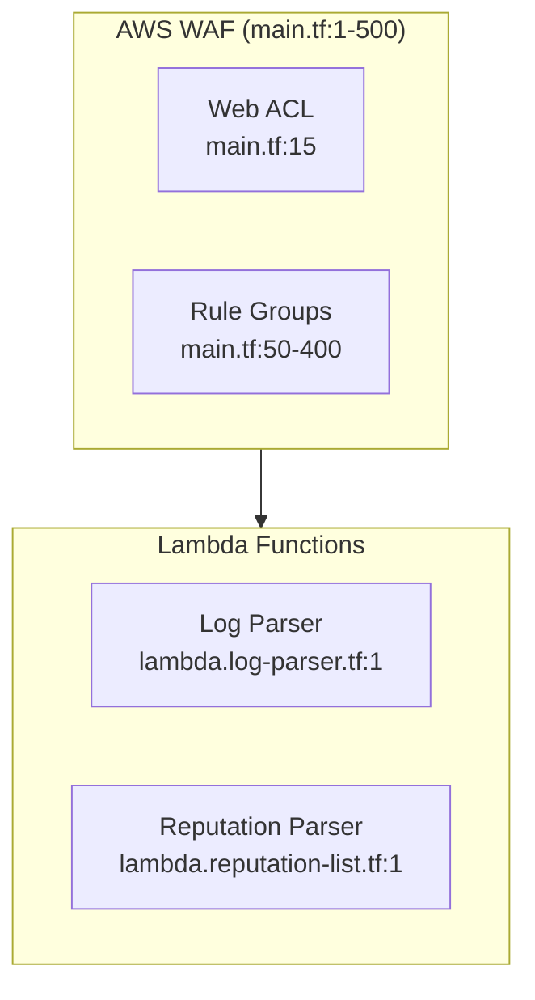
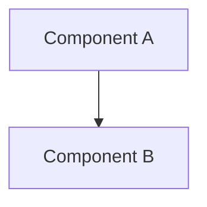

# Claude Code Best Practices & Working Guidelines

> This document captures learnings and best practices from the terraform-waf-module project. It serves as a template for Claude to follow when working on infrastructure, documentation, and software engineering tasks.

---

## Table of Contents

1. [Core Working Principles](#1-core-working-principles)
2. [Official Documentation Research](#2-official-documentation-research)
3. [Documentation Standards](#3-documentation-standards)
4. [Architecture Diagrams](#4-architecture-diagrams)
5. [Required Documentation Files](#5-required-documentation-files)
6. [Testing Strategy](#6-testing-strategy)
7. [GitHub Issues & Project Management](#7-github-issues--project-management)
8. [Todo List Usage](#8-todo-list-usage)
9. [Validation & Anti-Hallucination](#9-validation--anti-hallucination)
10. [Code References](#10-code-references)
11. [CI/CD Best Practices](#11-cicd-best-practices)
12. [Retrospective Process](#12-retrospective-process)

---

## 1. Core Working Principles

### 1.1 Read Before Writing

**ALWAYS read existing code before making changes.**

```
❌ BAD: Propose changes without understanding existing code
✅ GOOD: Read file → Understand patterns → Propose changes
```

- Use `Read` tool to examine files before editing
- Use `Grep` to find existing patterns and conventions
- Use `Glob` to discover file structure
- Use `Task` with Explore agent for broader codebase understanding

### 1.2 Verify Before Acting

**Never assume - always verify.**

- Check if files/directories exist before creating
- Verify naming conventions match existing code
- Confirm dependencies are available
- Test commands before documenting them

### 1.3 Incremental Progress

**Break work into small, verifiable steps.**

1. Make one change at a time
2. Verify the change works
3. Document what was done
4. Move to next step

### 1.4 Keep It Simple

**Avoid over-engineering.**

- Only implement what's requested
- Don't add features "just in case"
- Prefer simple solutions over clever ones
- Don't refactor unrelated code

---

## 2. Official Documentation Research

### 2.1 Why Official Docs Come First

**ALWAYS consult official documentation before implementing or documenting.**

```
❌ BAD: Assume you know how a Terraform resource works
✅ GOOD: Read Terraform docs → Verify attributes → Implement correctly
```

Official documentation:
- Contains the **authoritative truth** about APIs, resources, and configurations
- Is regularly updated with new features and deprecations
- Includes examples that are tested and verified
- Documents edge cases and limitations
- **Prevents hallucination** of non-existent attributes or parameters

### 2.2 Documentation Sources by Technology

**Always reference these official sources:**

| Technology | Official Documentation | Use For |
|------------|----------------------|---------|
| **Terraform** | https://registry.terraform.io/providers/hashicorp/aws/latest/docs | Resource attributes, arguments, examples |
| **AWS** | https://docs.aws.amazon.com/ | Service limits, best practices, architecture |
| **Python** | https://docs.python.org/3/ | Language features, standard library |
| **Docker** | https://docs.docker.com/ | Dockerfile syntax, best practices |
| **GitHub Actions** | https://docs.github.com/en/actions | Workflow syntax, contexts, expressions |

### 2.3 Research Workflow

**Before writing any infrastructure code:**

```bash
# Step 1: Identify the resource/service needed
"I need to create an AWS WAF Web ACL"

# Step 2: Find official documentation
Use WebFetch or WebSearch to get:
- Terraform Registry: aws_wafv2_web_acl resource docs
- AWS Docs: WAF service documentation

# Step 3: Extract key information
- Required arguments
- Optional arguments
- Valid values for enums
- Dependencies on other resources
- Known limitations

# Step 4: Verify against existing code
- Does existing code follow these patterns?
- Are there deprecated attributes being used?

# Step 5: Implement with references
- Include doc links in code comments where helpful
- Reference specific doc sections in PR descriptions
```

### 2.4 What to Look For in Official Docs

**When reading Terraform provider docs:**

```markdown
## Key Sections to Review

1. **Argument Reference**
   - Required vs optional arguments
   - Valid types and values
   - Default values

2. **Attribute Reference**
   - What outputs are available
   - Computed vs user-provided

3. **Example Usage**
   - Copy working examples as starting point
   - Note any prerequisites shown

4. **Import**
   - How to import existing resources
   - Required format for import ID

5. **Notes/Warnings**
   - Known issues
   - Deprecation notices
   - Breaking changes
```

### 2.5 Documenting Sources

**Always cite official documentation in your work:**

```markdown
## In Code Comments (sparingly, for complex cases)
```hcl
# WAF Web ACL with CloudFront scope
# Ref: https://registry.terraform.io/providers/hashicorp/aws/latest/docs/resources/wafv2_web_acl
resource "aws_wafv2_web_acl" "main" {
  # scope must be CLOUDFRONT for CloudFront distributions
  # Ref: AWS WAF scope requirements
  scope = "CLOUDFRONT"
}
```

## In Documentation
"The Lambda function uses Python 3.13 runtime, which is the latest
supported version for AWS Lambda as of 2024.
(Source: [AWS Lambda runtimes](https://docs.aws.amazon.com/lambda/latest/dg/lambda-runtimes.html))"

## In PR Descriptions
"Implemented based on:
- Terraform WAF docs: https://registry.terraform.io/...
- AWS WAF best practices: https://docs.aws.amazon.com/..."
```

### 2.6 Version-Specific Documentation

**Be aware of version differences:**

```markdown
## Check Documentation Version

1. **Terraform Provider Version**
   - Docs may differ between provider versions
   - Check `versions.tf` for required provider version
   - Match documentation to that version

2. **AWS Service Updates**
   - AWS services evolve rapidly
   - New features may not be in older provider versions
   - Check AWS "What's New" for recent changes

3. **Runtime Versions**
   - Python 3.13 vs 3.12 have different features
   - Lambda runtime support changes over time
   - Always verify current supported versions
```

### 2.7 When Documentation is Unclear

**If official docs are insufficient:**

1. **Check GitHub Issues** - Others may have same question
2. **Review Source Code** - Open source providers have readable code
3. **Test in Isolation** - Create minimal example to verify behavior
4. **Ask User** - If still unclear, ask for clarification

```markdown
❌ DON'T: Guess or assume behavior
✅ DO: Research → Test → Verify → Document findings
```

### 2.8 Common Documentation Anti-Patterns

| Anti-Pattern | Risk | Better Approach |
|--------------|------|-----------------|
| Relying on memory | May be outdated or wrong | Always check current docs |
| Copying from Stack Overflow | May be outdated or incorrect | Verify against official docs |
| Assuming attribute names | Hallucination risk | Look up exact names in docs |
| Skipping deprecation notices | Future breakage | Read warnings, plan migration |
| Ignoring version requirements | Compatibility issues | Match versions to docs |

---

## 3. Documentation Standards

### 3.1 Layered Documentation Approach

Create documentation at multiple levels:

| Layer | File | Audience | Content |
|-------|------|----------|---------|
| **Executive** | `README.md` | Users, New developers | Overview, Quick start, Features |
| **Operational** | `docs/TESTING.md` | Developers, DevOps | How to run, test, deploy |
| **Technical** | `docs/ARCHITECTURE.md` | Maintainers | Deep technical details |
| **Project** | `CHANGELOG.md`, `TODOLIST.md` | Team | Status, decisions, history |

### 3.2 Documentation Requirements

Every documentation file should include:

1. **Clear purpose statement** - What is this document about?
2. **Table of contents** - For files longer than 3 sections
3. **Code examples** - Copy-pasteable commands
4. **Expected output** - What should users see?
5. **Troubleshooting** - Common issues and solutions
6. **Code references** - File:line mappings to source

### 3.3 Writing Style

```markdown
# Good Documentation Practices

## Use Active Voice
❌ "The build can be triggered by..."
✅ "Run `make build` to trigger..."

## Be Specific
❌ "Configure the settings appropriately"
✅ "Set `ENABLE_LOGGING=true` in `.env`"

## Include Examples
❌ "Run the test command"
✅ "Run `make test` - expected output: 'All 18 tests passed'"

## Reference Source Code
❌ "The Lambda function processes logs"
✅ "The Lambda function (`lambda.log-parser.tf:45`) processes logs"
```

---

## 4. Architecture Diagrams

### 4.1 Why Diagrams Are Critical

Architecture diagrams are **NOT optional**. They:

- Provide visual understanding faster than text
- Serve as a contract between documentation and code
- Enable quick onboarding of new team members
- Help identify design issues early
- **Must be traceable to source code** (prevents hallucination)

### 4.2 Required Diagram Types

For infrastructure projects, create these diagrams:

| Diagram Type | Purpose | Tool |
|--------------|---------|------|
| **System Architecture** | Overall component relationships | Mermaid flowchart |
| **Data Flow** | How data moves through the system | Mermaid flowchart |
| **Sequence Diagrams** | Time-ordered interactions | Mermaid sequence |
| **CI/CD Pipeline** | Build and deployment flow | Mermaid flowchart |
| **Decision Trees** | Complex conditional logic | Mermaid flowchart |

### 4.3 Mermaid Diagram Standards

**Always use Mermaid for diagrams** (renders in GitHub, no external tools needed).

```markdown
## Example: System Architecture with Code References


```

### 4.4 Diagram Traceability Table

**Every diagram MUST have a corresponding code reference table:**

```markdown
## Code References for Architecture Diagram

| Diagram Element | Source File | Line Numbers | Purpose |
|-----------------|-------------|--------------|---------|
| Web ACL | `main.tf` | 15-45 | WAF access control list |
| Log Parser Lambda | `lambda.log-parser.tf` | 1-89 | Process WAF logs |
| S3 Trigger | `lambda.log-parser.tf` | 91-105 | Invoke on new logs |
```

This table:
- Validates diagram accuracy
- Prevents documentation drift
- Enables quick code navigation
- **Proves the diagram isn't hallucinated**

---

## 5. Required Documentation Files

### 5.1 Minimum Documentation Set

Every project should have:

| File | Required | Purpose |
|------|----------|---------|
| `README.md` | ✅ Yes | Project overview, quick start |
| `CHANGELOG.md` | ✅ Yes | Version history, decisions |
| `docs/ARCHITECTURE.md` | ✅ Yes | Technical architecture |
| `docs/TESTING.md` | ✅ Yes | How to run tests |
| `.github/workflows/README.md` | If CI/CD | Workflow documentation |
| `scripts/README.md` | If scripts | Script documentation |
| `TODOLIST.md` | Optional | Implementation tracking |
| `CONTRIBUTING.md` | Optional | Contribution guidelines |

### 5.2 README.md Template

```markdown
# Project Name

Brief description (1-2 sentences).

## Architecture



## Features

- Feature 1: Description
- Feature 2: Description

## Quick Start

```bash
# Prerequisites
tool --version  # Required: >= X.Y.Z

# Installation
make install

# Run
make run
```

## Documentation

- [Architecture](docs/ARCHITECTURE.md)
- [Testing](docs/TESTING.md)

## Requirements

| Requirement | Version |
|-------------|---------|
| Terraform | >= 1.0 |
| Docker | >= 20.0 |
```

### 5.3 TESTING.md Template

```markdown
# Testing Guide

## Prerequisites

| Tool | Version | Installation |
|------|---------|--------------|
| Docker | >= 20.0 | `brew install docker` |

## Quick Start

```bash
make test        # Quick tests (~5s)
make test-local  # Full suite (~60s)
make test-all    # Everything (~120s)
```

## Test Categories

### 1. Unit Tests
- What: Individual function testing
- How: `make unit-test`
- Expected: "X tests passed"

### 2. Integration Tests
- What: Component interaction testing
- How: `make integration-test`
- Expected: "All integrations verified"

### 3. Architectural Tests
- What: Verify system design constraints and dependencies
- How: `make arch-test`
- Expected: "Architecture constraints satisfied"
- Examples: Module boundaries, dependency direction, layer violations

### 4. Functional Tests
- What: Verify business requirements and user workflows
- How: `make functional-test`
- Expected: "All functional requirements met"
- Examples: User stories, acceptance criteria, business rules

### 5. Security Tests
- What: Vulnerability scanning
- How: `make security`
- Expected: "No HIGH/CRITICAL issues"

## Troubleshooting

### Issue: Docker not running
**Solution:** Start Docker Desktop or run `systemctl start docker`

### Issue: Permission denied
**Solution:** Add user to docker group: `sudo usermod -aG docker $USER`
```

---

## 6. Testing Strategy

### 6.1 Layered Testing Approach

Implement tests in layers (fast → slow, cheap → expensive):

```
Layer 1: Syntax Validation (seconds)
    └── Catches: Typos, missing brackets, invalid syntax

Layer 2: Format/Style (seconds)
    └── Catches: Inconsistent formatting, style violations

Layer 3: Linting (seconds-minutes)
    └── Catches: Bad practices, potential bugs

Layer 4: Security Scanning (minutes)
    └── Catches: Vulnerabilities, misconfigurations

Layer 5: Unit Tests (minutes)
    └── Catches: Logic errors, edge cases

Layer 6: Architectural Tests (minutes)
    └── Catches: Design constraint violations, wrong dependencies
    └── Examples: Module boundary violations, circular dependencies

Layer 7: Integration Tests (minutes-hours)
    └── Catches: Component interaction issues

Layer 8: Functional Tests (minutes-hours)
    └── Catches: Business logic errors, requirement gaps
    └── Examples: User workflow failures, acceptance criteria not met

Layer 9: End-to-End Tests (hours)
    └── Catches: Full system issues
```

### 6.2 Test Documentation Requirements

Every test suite should document:

1. **What it tests** - Clear description
2. **How to run it** - Exact command
3. **Expected output** - What success looks like
4. **Common failures** - Known issues and solutions
5. **Test coverage** - What IS and ISN'T tested

### 6.3 Positive vs Negative Tests

**DEFAULT: Always include BOTH positive and negative tests.**

This surfaces issues early and enables faster fixes. Both test types serve different purposes:

```bash
# Positive Tests (verify things WORK)
✅ File exists and is not empty
✅ Contains required components
✅ Meets size/performance requirements
✅ Function returns expected output
✅ API responds with correct status code

# Negative Tests (catch PROBLEMS)
❌ No forbidden files present
❌ No invalid syntax
❌ No security vulnerabilities
❌ Rejects invalid input gracefully
❌ Handles error conditions correctly
❌ No regression from previous bugs
```

### 6.4 When Only Positive Tests Are Acceptable

**Exception:** Only use positive-only tests when explicitly requested, typically for:

| Scenario | Reason | Example |
|----------|--------|---------|
| **Production code coverage** | Need test coverage metrics without changing existing behavior | Adding tests to legacy code before refactoring |
| **Initial baseline** | Establishing what currently works before adding negative tests | Documenting existing system behavior |
| **Read-only validation** | Verifying current state without asserting what shouldn't exist | Audit/compliance checks |

```markdown
❌ DON'T: Default to positive-only tests (misses problems)
✅ DO: Include both types unless explicitly told otherwise
✅ DO: Document WHY if only positive tests are used
```

**Remember:** Negative tests catch issues that positive tests miss. A test suite with only positive tests gives false confidence.

### 6.5 Testing Commands Pattern

Use Makefile for consistent test running:

```makefile
# Quick feedback loop (run frequently)
test: validate fmt
	@echo "Quick tests passed"

# Local development (before commit)
test-local: test lint security
	@echo "Local tests passed"

# Complete suite (before PR)
test-all: test-local build integration
	@echo "All tests passed"
```

---

## 7. GitHub Issues & Project Management

### 7.1 Issue Creation Standards

When creating GitHub issues:

```markdown
## Issue Title
[TYPE] Brief description

Types: [BUG], [FEATURE], [DOCS], [SECURITY], [REFACTOR]

## Issue Body Template

### Description
Clear description of what needs to be done.

### Acceptance Criteria
- [ ] Criterion 1
- [ ] Criterion 2
- [ ] Tests pass
- [ ] Documentation updated

### Technical Notes
- Relevant file: `path/to/file.tf:line`
- Related issues: #123, #456

### Implementation Hints
1. Start by...
2. Then...
3. Finally...
```

### 7.2 Issue References

**Always reference code locations in issues:**

```markdown
❌ BAD: "Fix the Lambda function timeout"
✅ GOOD: "Fix Lambda timeout in `lambda.log-parser.tf:67` - increase from 60s to 300s"
```

### 7.3 Linking Issues to Code

When closing issues via commits:

```bash
git commit -m "feat(lambda): increase timeout to 300s

Fixes #123

Changes:
- lambda.log-parser.tf:67 - timeout 60 → 300
- docs/ARCHITECTURE.md - updated diagram

Co-Authored-By: Claude Opus 4.5 <noreply@anthropic.com>"
```

---

## 8. Todo List Usage

### 8.1 When to Use Todo Lists

**Use TodoWrite tool when:**

- Task has 3+ distinct steps
- Work spans multiple files
- Need to track progress for user visibility
- Breaking down complex features
- Following multi-step procedures

**Don't use for:**

- Single-file changes
- Simple questions
- Trivial fixes

### 8.2 Todo List Best Practices

```markdown
## Good Todo Items

✅ "Update Lambda timeout in lambda.log-parser.tf"
✅ "Add architecture diagram to README.md"
✅ "Run security scan and document accepted issues"

## Bad Todo Items

❌ "Fix stuff" (too vague)
❌ "Maybe look at this later" (not actionable)
❌ "Refactor everything" (too broad)
```

### 8.3 Progress Tracking

**Update todos in real-time:**

1. Mark `in_progress` when starting a task
2. Mark `completed` immediately when done
3. Only have ONE task `in_progress` at a time
4. Add new tasks as discovered
5. Remove irrelevant tasks

---

## 9. Validation & Anti-Hallucination

### 9.1 The Hallucination Problem

**Claude can generate plausible but incorrect information.** Combat this by:

1. **Verifying file existence** before referencing
2. **Reading actual code** before describing it
3. **Including code references** in all documentation
4. **Testing commands** before documenting them
5. **Using Grep/Glob** to confirm patterns exist

### 9.2 Validation Checklist

Before finalizing any documentation:

```markdown
## Pre-Commit Validation

- [ ] All referenced files exist (verified with Glob)
- [ ] All line numbers are accurate (verified with Read)
- [ ] All commands work (verified with Bash)
- [ ] All diagrams have code reference tables
- [ ] No placeholder text remains
- [ ] No "TODO" or "FIXME" without issue links
```

### 9.3 Code Reference as Proof

**Every claim should be verifiable:**

```markdown
❌ UNVERIFIABLE (possible hallucination):
"The Lambda function uses Python 3.13"

✅ VERIFIABLE (with proof):
"The Lambda function uses Python 3.13 (see `scripts/Dockerfile.lambda-builder:1` -
`FROM public.ecr.aws/lambda/python:3.13`)"
```

### 9.4 Diagram Verification Process

When creating diagrams:

1. **Read relevant source files** first
2. **Extract actual component names** from code
3. **Create diagram** using real names
4. **Build code reference table** with line numbers
5. **Verify each reference** is accurate

```bash
# Example verification workflow
1. Read main.tf → Found "aws_wafv2_web_acl" at line 15
2. Read lambda.log-parser.tf → Found "aws_lambda_function" at line 45
3. Create diagram with these exact resources
4. Add table: | Web ACL | main.tf | 15 | aws_wafv2_web_acl |
5. Verify: Use Read tool to confirm line 15 has aws_wafv2_web_acl
```

---

## 10. Code References

### 10.1 Reference Format

Use consistent format for code references:

```markdown
## Formats

Inline: `filename.tf:line`
Block: `path/to/file.tf:start-end`
Function: `file.py:function_name():line`

## Examples

- `main.tf:15` - Single line reference
- `main.tf:15-45` - Line range
- `lambda.log-parser.tf:aws_lambda_function` - Resource reference
- `build-lambda.sh:build_package():120` - Function reference
```

### 10.2 When to Include References

**Always include references for:**

- Architecture documentation
- Troubleshooting guides
- Configuration explanations
- Feature descriptions
- Bug reports

### 10.3 Reference Tables

For complex documentation, create reference tables:

```markdown
## Code Reference Table

| Component | File | Lines | Resource/Function |
|-----------|------|-------|-------------------|
| WAF ACL | main.tf | 15-45 | aws_wafv2_web_acl.main |
| Log Parser | lambda.log-parser.tf | 1-89 | aws_lambda_function.log_parser |
| S3 Trigger | lambda.log-parser.tf | 91-105 | aws_s3_bucket_notification |
| Build Script | scripts/build-lambda.sh | 1-250 | build_package() |
```

---

## 11. CI/CD Best Practices

### 11.1 Two-Workflow Pattern

Separate concerns into distinct workflows:

```yaml
# Workflow 1: Automatic Testing (test.yml)
Triggers: push, pull_request
Purpose: Validate code quality
Actions: lint, test, security scan
Permissions: read-only

# Workflow 2: Manual Build (build.yml)
Triggers: workflow_dispatch (manual)
Purpose: Create artifacts
Actions: build, package, create PR
Permissions: write (controlled)
```

### 11.2 Workflow Documentation

Every workflow should have:

1. **Trigger documentation** - What starts this workflow?
2. **Job descriptions** - What does each job do?
3. **Input/output specs** - What goes in, what comes out?
4. **Permission rationale** - Why these permissions?
5. **Troubleshooting guide** - Common issues and fixes

### 11.3 Security Considerations

```yaml
# Minimal Permissions (CKV2_GHA_1)
permissions:
  contents: read  # Default to read-only

# Document exceptions
permissions:
  contents: write        # Required for: creating commits
  pull-requests: write   # Required for: creating PRs
```

### 11.4 Artifact Management

```markdown
## Artifact Checklist

- [ ] Artifacts are versioned (semantic versioning)
- [ ] Build process is reproducible (Docker)
- [ ] Artifacts are tested before commit
- [ ] Size limits are enforced (Lambda: <50MB)
- [ ] Security scan completed (pip-audit, tfsec)
```

---

## 12. Retrospective Process

### 12.1 When to Retrospect

Conduct retrospectives:

- After completing major features
- After fixing significant bugs
- After any incident/outage
- At regular intervals (weekly/monthly)

### 12.2 Retrospective Template

```markdown
# Retrospective: [Feature/Project Name]

## Date: YYYY-MM-DD

## What We Built
Brief description of deliverables.

## What Went Well
- Item 1
- Item 2

## What Could Improve
- Item 1 → Action: [specific action]
- Item 2 → Action: [specific action]

## Key Learnings
1. Learning 1
2. Learning 2

## Action Items
- [ ] Action 1 (Owner: @person)
- [ ] Action 2 (Owner: @person)

## Metrics
| Metric | Value |
|--------|-------|
| Time spent | X hours |
| Files changed | Y |
| Tests added | Z |
```

### 12.3 Capturing Learnings

Document learnings immediately:

1. **What worked** - Patterns to repeat
2. **What didn't work** - Patterns to avoid
3. **Surprises** - Unexpected challenges
4. **Tool discoveries** - Useful tools/techniques
5. **Process improvements** - Better ways to work

### 12.4 Updating This Document

This `claude.md` should be updated when:

- New patterns are discovered
- Better approaches are found
- Tools/processes change
- Mistakes are made (add to anti-patterns)

---

## Quick Reference Checklist

### Before Starting Work

- [ ] **Read official documentation** for technologies being used
- [ ] Read existing code and documentation
- [ ] Understand current patterns and conventions
- [ ] Create todo list for complex tasks
- [ ] Identify required documentation updates

### During Work

- [ ] Update todo list as tasks complete
- [ ] Verify each change works
- [ ] Add code references to documentation
- [ ] Run tests frequently

### Before Committing

- [ ] All tests pass
- [ ] Documentation updated with code references
- [ ] Diagrams have traceability tables
- [ ] No hallucinated content (all verified)
- [ ] CHANGELOG updated if significant

### After Completing

- [ ] Review what was learned
- [ ] Update this document if new patterns discovered
- [ ] Close related issues with references
- [ ] Consider retrospective for large changes

---

## Anti-Patterns to Avoid

| Anti-Pattern | Why It's Bad | Better Approach |
|--------------|--------------|-----------------|
| Skipping official docs | Hallucination of APIs/attributes | Always consult official docs first |
| Writing without reading | May duplicate/conflict | Read first, then write |
| Diagrams without references | Can't verify accuracy | Always include code refs |
| Vague documentation | Not actionable | Be specific, include examples |
| Skipping tests | Bugs slip through | Test at every layer |
| Batch completing todos | Loses progress visibility | Complete in real-time |
| Assuming code exists | Hallucination risk | Verify with Glob/Read |
| Over-engineering | Wastes time, adds complexity | Implement only what's needed |
| Undocumented decisions | Knowledge loss | Record in CHANGELOG |
| Relying on memory for APIs | May be outdated or wrong | Always verify current docs |
| Copying from Stack Overflow | May be outdated/incorrect | Verify against official docs |

---

*Last updated: Based on terraform-waf-module project learnings*
*Version: 1.0.0*
