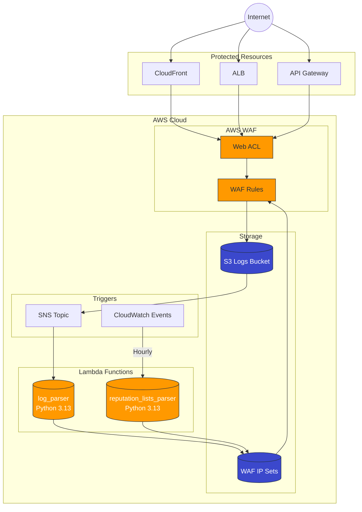
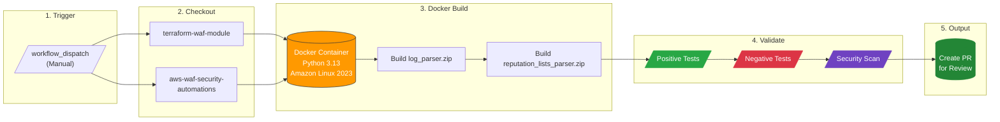
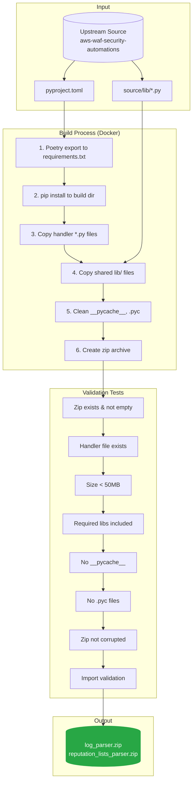
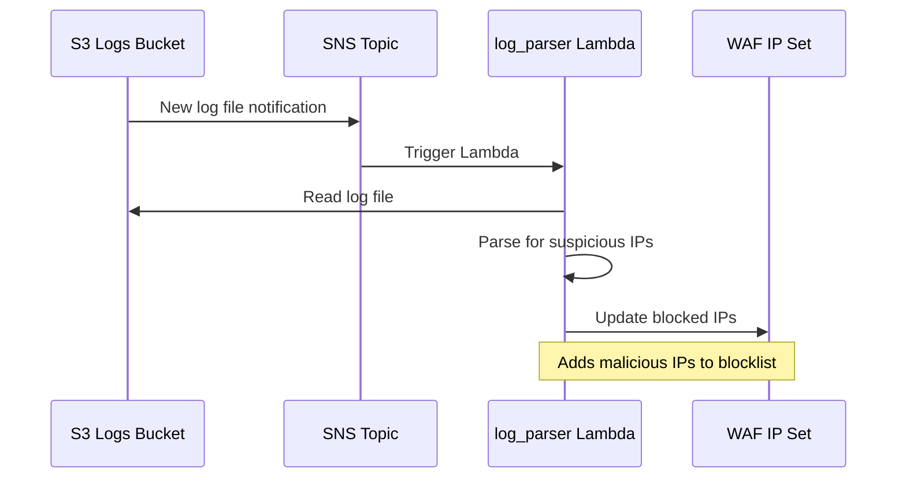
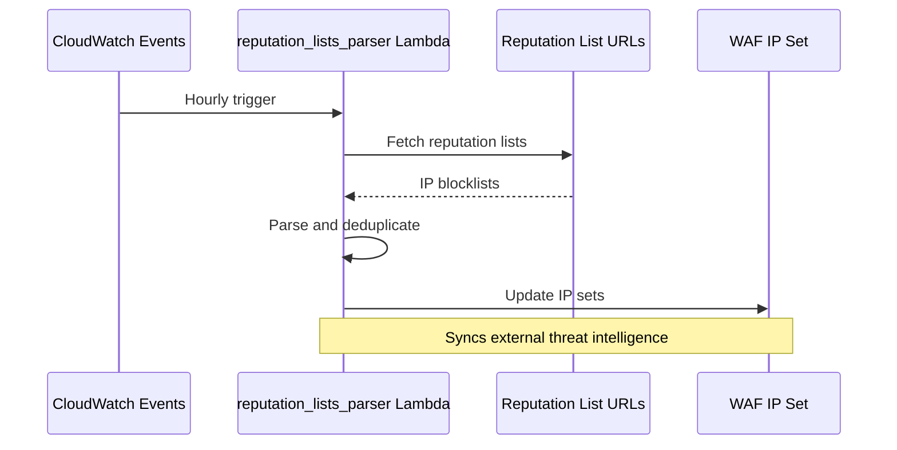

# Architecture Documentation

This document describes the architecture of the terraform-waf-module and its CI/CD pipeline.

## System Overview



## CI/CD Build Pipeline



## Build Process Detail



## Lambda Function Flow

### Log Parser



### Reputation Lists Parser



## Python Version Decision


## File Structure

```
terraform-waf-module/
├── .github/
│   └── workflows/
│       └── build-lambda-packages.yml  # CI/CD pipeline
├── docs/
│   └── ARCHITECTURE.md                # This file
├── lambda/
│   ├── log_parser.zip                 # Built artifact
│   ├── reputation_lists_parser.zip    # Built artifact
│   └── LICENSE.txt
├── scripts/
│   ├── Dockerfile.lambda-builder      # Build environment
│   └── build-lambda.sh                # Build script
├── lambda.log-parser.tf               # Lambda TF config
├── lambda.reputation-list.tf          # Lambda TF config
├── main.tf                            # WAF Web ACL
├── CHANGELOG.md                       # Version history
├── TODOLIST.md                        # Implementation tasks
└── README.md                          # Project documentation
```
