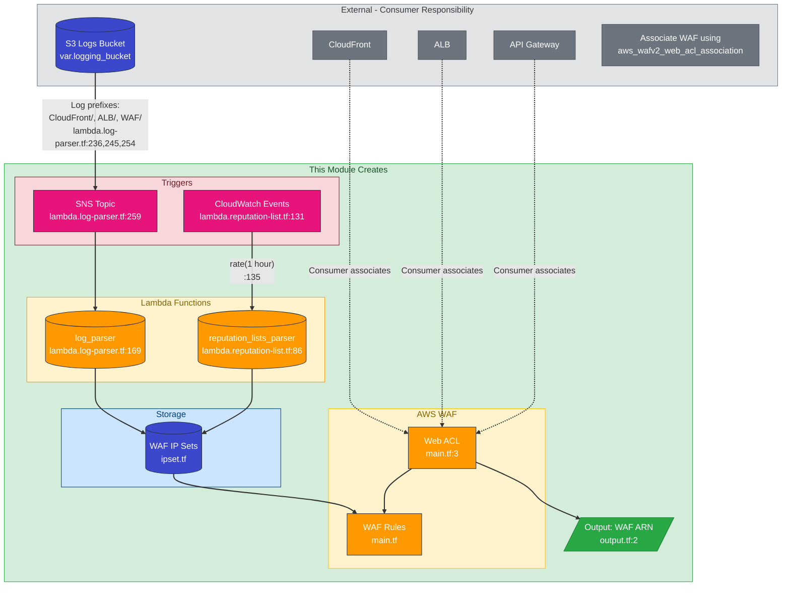
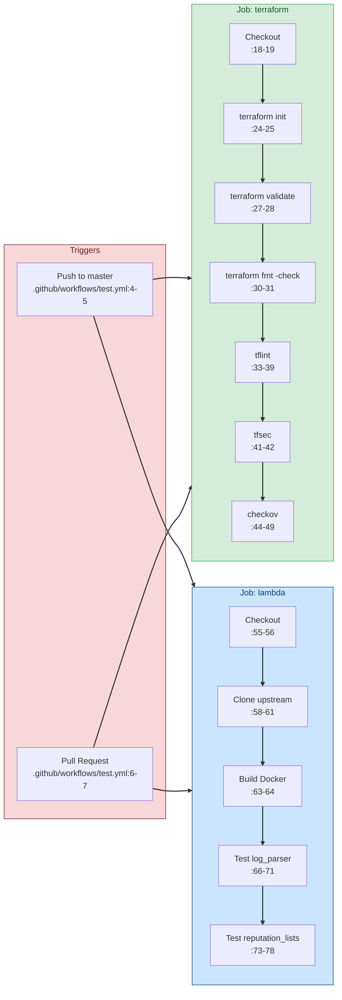
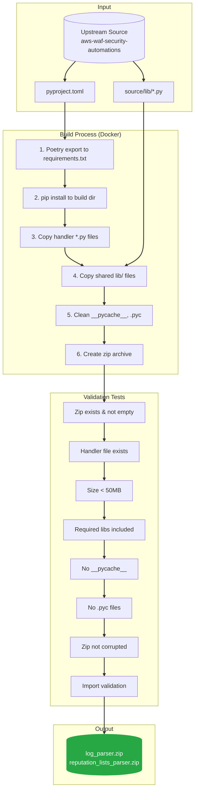
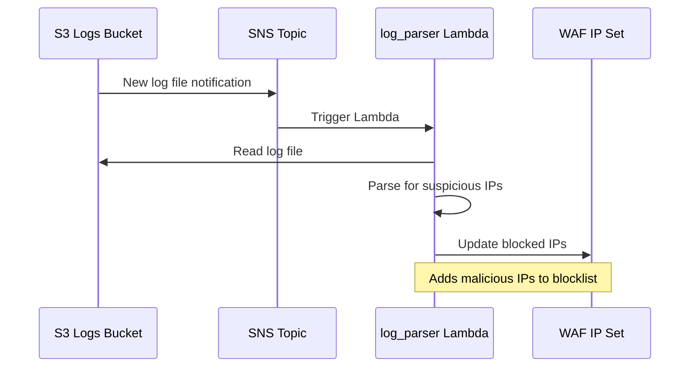
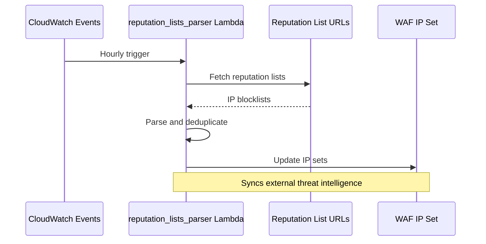
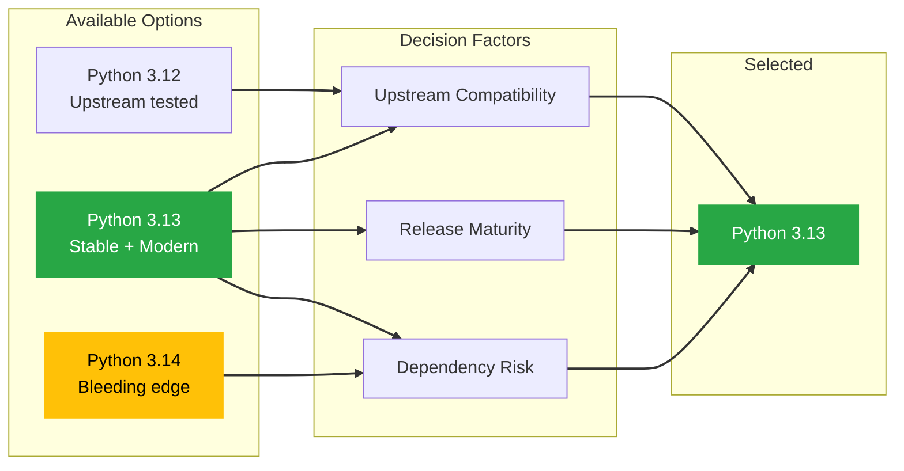

# Architecture Documentation

This document describes the architecture of the terraform-waf-module and its CI/CD pipeline.

## System Overview



> **Note:** This module creates the WAF Web ACL and outputs its ARN. The consumer must create their own CloudFront, ALB, or API Gateway and associate them with the WAF using `aws_wafv2_web_acl_association`.

## CI/CD Build Pipeline


## CI/CD Test Workflow (test.yml)

This workflow runs automatically on every push to `master` and on pull requests.



## Build Process Detail



## Lambda Function Flow

### Log Parser



### Reputation Lists Parser



## Python Version Decision



## File Structure

```
terraform-waf-module/
├── .github/
│   └── workflows/
│       └── build-lambda-packages.yml  # CI/CD pipeline
├── docs/
│   ├── ARCHITECTURE.md                # This file
│   └── TESTING.md                     # Testing guide
├── lambda/
│   ├── log_parser.zip                 # Built artifact
│   ├── reputation_lists_parser.zip    # Built artifact
│   └── LICENSE.txt
├── scripts/
│   ├── Dockerfile.lambda-builder      # Build environment
│   └── build-lambda.sh                # Build script
├── lambda.log-parser.tf               # Lambda TF config
├── lambda.reputation-list.tf          # Lambda TF config
├── main.tf                            # WAF Web ACL
├── Makefile                           # Build and test automation
├── CHANGELOG.md                       # Version history
├── TODOLIST.md                        # Implementation tasks
└── README.md                          # Project documentation
```

---

## Code References

This section provides traceability for all diagram elements to their source code locations.

### System Overview Diagram

#### Resources Created by This Module

| Diagram Element | File:Line | Evidence |
|-----------------|-----------|----------|
| WAF Web ACL | `main.tf:3` | `resource "aws_wafv2_web_acl" "main"` |
| WAF scope (CLOUDFRONT/REGIONAL) | `main.tf:5`, `variables.tf:6-8` | `scope = var.scope` |
| Output WAF ARN | `output.tf:2` | `value = aws_wafv2_web_acl.main.arn` |
| log_parser Lambda | `lambda.log-parser.tf:169` | `resource "aws_lambda_function" "log-parser"` |
| reputation_lists_parser Lambda | `lambda.reputation-list.tf:86` | `resource "aws_lambda_function" "reputation-list"` |
| SNS Topic | `lambda.log-parser.tf:259` | `resource "aws_sns_topic" "log-parser"` |
| CloudWatch Event Rule | `lambda.reputation-list.tf:131` | `resource "aws_cloudwatch_event_rule" "reputation-list"` |
| IP Sets | `ipset.tf:6,17,28,39,50,61,73,84,95,106,117,128` | Multiple `aws_wafv2_ip_set` resources |

#### Trigger Configuration

| Diagram Element | File:Line | Evidence |
|-----------------|-----------|----------|
| log_parser triggered by SNS | `lambda.log-parser.tf:287-291` | `aws_sns_topic_subscription.log-parser` |
| S3 notifications to SNS | `lambda.log-parser.tf:227-257` | `aws_s3_bucket_notification.log-parser` |
| S3 prefixes: CloudFront, ALB, WAF | `lambda.log-parser.tf:236,245,254` | `filter_prefix` for each log type |
| reputation_lists_parser hourly trigger | `lambda.reputation-list.tf:131-136` | `schedule_expression = "rate(1 hour)"` |

#### IP Set Updates

| Diagram Element | File:Line | Evidence |
|-----------------|-----------|----------|
| log_parser updates HTTP Flood IP Sets | `lambda.log-parser.tf:153-154` | `HTTPFloodSetIPV4.arn`, `HTTPFloodSetIPV6.arn` |
| log_parser updates Scanners/Probes IP Sets | `lambda.log-parser.tf:106-107` | `ScannersProbesSetIPV4.arn`, `ScannersProbesSetIPV6.arn` |
| reputation_lists_parser updates Reputation IP Sets | `lambda.reputation-list.tf:50-51` | `IPReputationListsSetIPV4.arn`, `IPReputationListsSetIPV6.arn` |
| Python 3.13 runtime | `lambda.log-parser.tf:176`, `lambda.reputation-list.tf:94` | `runtime = "python3.13"` |

#### External Resources (NOT Created by This Module)

| Element | Status | Consumer Action Required |
|---------|--------|--------------------------|
| CloudFront Distribution | **NOT IN MODULE** | Consumer creates and associates using `aws_wafv2_web_acl_association` |
| Application Load Balancer | **NOT IN MODULE** | Consumer creates and associates using `aws_wafv2_web_acl_association` |
| API Gateway | **NOT IN MODULE** | Consumer creates and associates using `aws_wafv2_web_acl_association` |
| S3 Logs Bucket | **NOT IN MODULE** | Consumer provides via `var.logging_bucket` |

### Reputation Lists - External URLs

| URL | File:Line |
|-----|-----------|
| `https://www.spamhaus.org/drop/drop.txt` | `lambda.reputation-list.tf:119` |
| `https://www.spamhaus.org/drop/edrop.txt` | `lambda.reputation-list.tf:119` |
| `https://check.torproject.org/exit-addresses` | `lambda.reputation-list.tf:119` |
| `https://rules.emergingthreats.net/fwrules/emerging-Block-IPs.txt` | `lambda.reputation-list.tf:119` |

### Build Process Diagram

| Step | File:Line | Command |
|------|-----------|---------|
| 1. Poetry export | `scripts/build-lambda.sh:79` | `poetry export --without dev -f requirements.txt` |
| 2. pip install | `scripts/build-lambda.sh:84` | `pip install -r ... -t "${BUILD_DIR}"` |
| 3. Copy handler files | `scripts/build-lambda.sh:94` | `cp -r "${SOURCE_DIR}"/*.py` |
| 4. Copy shared libs | `scripts/build-lambda.sh:105` | `cp "${LIB_DIR}"/*.py "${BUILD_DIR}/lib/"` |
| 5. Clean __pycache__ | `scripts/build-lambda.sh:123,126` | `find ... -name "__pycache__"` |
| 6. Create zip | `scripts/build-lambda.sh:136` | `zip -r -q "${OUTPUT_DIR}/${ZIP_NAME}"` |

### Validation Tests

| Test | File:Line | Check |
|------|-----------|-------|
| Test 1: Zip exists & not empty | `scripts/build-lambda.sh:150` | `-f ... && -s ...` |
| Test 2: Handler in zip | `scripts/build-lambda.sh:158` | `unzip -l ... \| grep -q "${HANDLER}"` |
| Test 3: Size < 50MB | `scripts/build-lambda.sh:166` | `stat` + size comparison |
| Test 4: Required libs | `scripts/build-lambda.sh:177-178` | Loop over `REQUIRED_LIBS` |
| Test 5: Zip integrity | `scripts/build-lambda.sh:190` | `unzip -t` |
| Test 6: No __pycache__ | `scripts/build-lambda.sh:198` | `grep -q "__pycache__"` (expect fail) |
| Test 7: No .pyc files | `scripts/build-lambda.sh:206` | `grep -q "\.pyc"` (expect fail) |
| Test 8: Import validation | `scripts/build-lambda.sh:224` | `python3 -c "import ..."` |

### CI/CD Pipeline Diagram

| Step | File:Line | Evidence |
|------|-----------|----------|
| workflow_dispatch trigger | `.github/workflows/build-lambda-packages.yml:4` | `on: workflow_dispatch:` |
| Checkout this repo | `.github/workflows/build-lambda-packages.yml:39-43` | `uses: actions/checkout@v4` |
| Checkout upstream | `.github/workflows/build-lambda-packages.yml:73-82` | `repository: aws-solutions/...` |
| Build Docker image | `.github/workflows/build-lambda-packages.yml:98-100` | `docker build -t lambda-builder` |
| Build log_parser.zip | `.github/workflows/build-lambda-packages.yml:102-108` | `docker run ... log_parser` |
| Build reputation_lists_parser.zip | `.github/workflows/build-lambda-packages.yml:110-116` | `docker run ... reputation_lists_parser` |
| pip-audit security scan | `.github/workflows/build-lambda-packages.yml:118-130` | `pip-audit -r ...` |
| Create PR | `.github/workflows/build-lambda-packages.yml:148-206` | `peter-evans/create-pull-request@v6` |

### CI/CD Test Workflow (test.yml)

| Step | File:Line | Evidence |
|------|-----------|----------|
| Workflow triggers | `.github/workflows/test.yml:3-7` | `on: push, pull_request` |
| Security permissions | `.github/workflows/test.yml:9-11` | `permissions: contents: read` |
| Terraform Init | `.github/workflows/test.yml:24-25` | `terraform init -backend=false` |
| Terraform Validate | `.github/workflows/test.yml:27-28` | `terraform validate` |
| Terraform fmt | `.github/workflows/test.yml:30-31` | `terraform fmt -check -recursive` |
| tflint setup | `.github/workflows/test.yml:33-34` | `setup-tflint@v4` |
| tflint run | `.github/workflows/test.yml:36-39` | `tflint --init && tflint` |
| tfsec | `.github/workflows/test.yml:41-42` | `tfsec-action@v1.0.0` |
| checkov | `.github/workflows/test.yml:44-49` | `checkov-action@v12, soft_fail: true` |
| Clone upstream | `.github/workflows/test.yml:58-61` | `git clone ... v4.0.3` |
| Docker build | `.github/workflows/test.yml:63-64` | `docker build -t lambda-builder` |
| Test log_parser | `.github/workflows/test.yml:66-71` | `lambda-builder log_parser` |
| Test reputation_lists | `.github/workflows/test.yml:73-78` | `lambda-builder reputation_lists_parser` |
| Summary output | `.github/workflows/test.yml:80-89` | `GITHUB_STEP_SUMMARY` |
